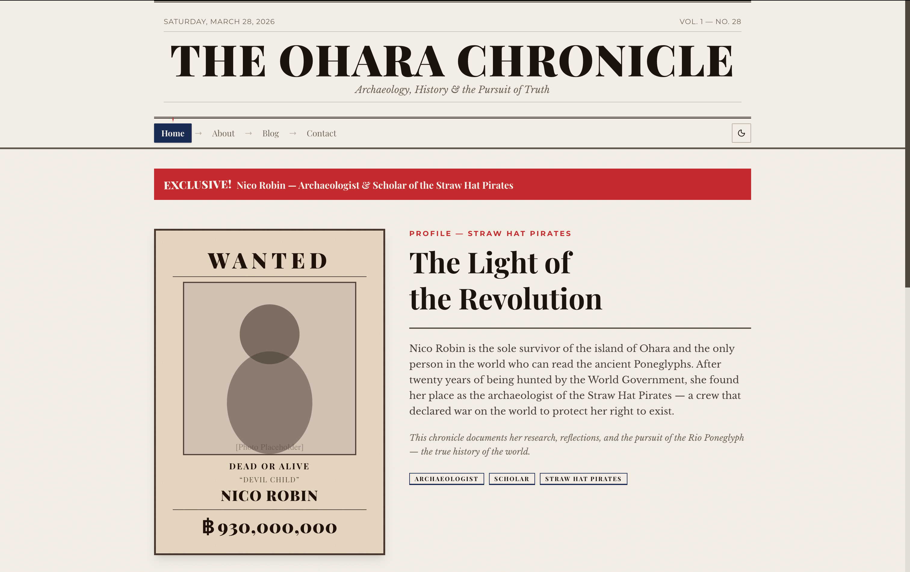

# The Ohara Chronicle — Newspaper Portfolio Blog Template



A newspaper-style blog portfolio template built with [newspapercn-ui](https://newspapercn-ui.vercel.app), a One Piece themed shadcn/ui variant library.

[](https://vercel.com/new/clone?repository-url=https://github.com/pyaephyowinn/newspaper-portfolio-blog-template)

## Features

- **10 custom components** from newspapercn-ui: Masthead, Wanted Poster, Headline Banner, Column Layout, Poneglyph Code, Bounty Table, Den Den Mushi, Log Pose Nav, News Coo Badge, Theme Toggle
- **7 enhanced base components** with newspaper variants: Card, Badge, Separator, Accordion, Pagination, Skeleton, Checkbox
- **4 pages**: Home, About, Blog (with dynamic routes), Contact
- **Dark mode** with system preference detection
- **Responsive** — mobile, tablet, desktop
- **Zero config** — works immediately after deploy

## Tech Stack

- [Next.js 16](https://nextjs.org/) — App Router
- [React 19](https://react.dev/)
- [Tailwind CSS v4](https://tailwindcss.com/) — OKLCH color space
- [TypeScript](https://www.typescriptlang.org/)
- [newspapercn-ui](https://newspapercn-ui.vercel.app) — shadcn/ui variant library

## Getting Started

```bash
pnpm install
pnpm dev
```

Open [http://localhost:3000](http://localhost:3000) to see the result.

## Customizing

This template is designed to be easily customized:

- **Change the character**: Edit the blog data in `lib/blog-data.ts` and the hero section in `app/page.tsx`
- **Add blog posts**: Add entries to the `blogPosts` array in `lib/blog-data.ts`
- **Modify theme**: Edit the OKLCH color tokens in `styles/newspaper-theme.css`
- **Add components**: Install more from the registry: `npx shadcn@latest add https://newspapercn-ui.vercel.app/r/[component].json`

## Component Showcase

| Component | Where Used |
|---|---|
| Masthead | Site header |
| Theme Toggle | Site header |
| Log Pose Nav | Navigation |
| Headline Banner | Home, Contact |
| Wanted Poster | Home hero |
| Card (featured/article) | Home, Blog |
| Badge (section/breaking) | Everywhere |
| News Coo Badge | Post indicators |
| Column Layout | About, Blog posts |
| Bounty Table | About page |
| Poneglyph Code | Blog posts |
| Den Den Mushi | Contact, Blog |
| Separator (ornamental) | Section dividers |

## Deploy

[](https://vercel.com/new/clone?repository-url=https://github.com/pyaephyowinn/newspaper-portfolio-blog-template)

## License

MIT
